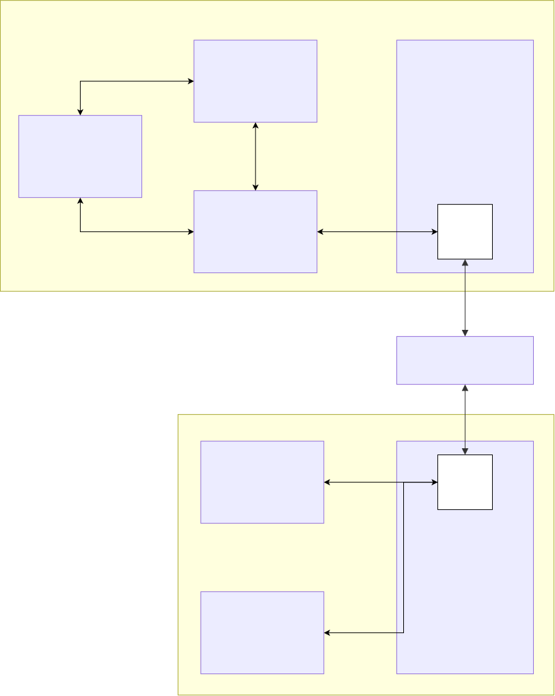
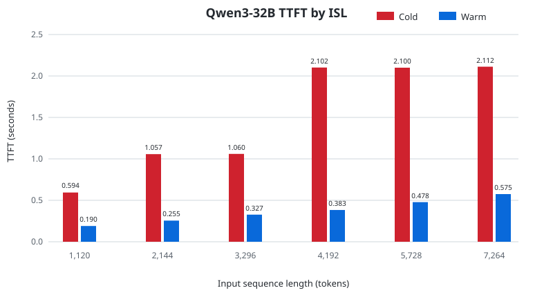
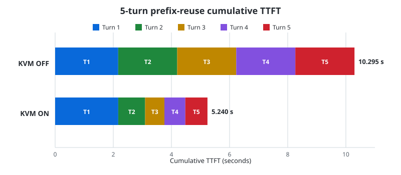

# TT-Infinity

## Overview

TT-Infinity provides a Fabric-based external KV cache for models running on Tenstorrent devices. It extends KV-cache capacity beyond device DRAM by sending values directly over Fabric to a `Server` on an external T3K node, where they are backed by host memory. This avoids routing the Galaxy data path through PCIe.

The core runtime and public Python/C++ package retain the name `kvcache-manager`. Project-level documentation refers to TT-Infinity, while commands, imports, libraries, and API names use the component name.

Before prefill, the vLLM scheduler uses LMCache's `exists` path to identify a reusable contiguous prefix. Workers restore hit blocks into the paged KV cache through `Client.get()`. When prefill creates new blocks, LMCacheConnector calls `Client.put()`, and the client asks the server to store them over TT-Fabric. The server provides storage, lookup, and deletion.

## Architecture

<p align="center"></p>

vLLM on Galaxy manages the model and paged KV cache. LMCacheConnector translates the vLLM cache lifecycle into `kvcache_manager.Client` operations. The client connects to `kvcache_manager.Server` on T3K and carries requests and responses over the internode Fabric path.

For PUT, LMCacheConnector passes KV blocks generated during prefill to the client. Values first arrive in server device DRAM and are then written through to an authoritative host-DRAM copy. If device-cache space is exhausted, only the device copy is evicted. TTNN supplies Fabric operations, protocols, and device kernels; this repository owns the public client/server APIs and lifecycle. See [Documentation](#documentation).

For GET, LMCacheConnector looks up a reusable prefix and requests its blocks through the client. The server returns values directly from device DRAM on a hit or reads the authoritative host copy on a miss. After restoration into vLLM's paged KV cache, vLLM skips prefill for that prefix.

## Supported Configurations

| Configuration | Client | Server | Status |
| --- | --- | --- | --- |
| Intranode | One chip on a host | Another chip on the same host | Fabric 1D and 2D supported |
| Internode | Galaxy | T3K | Fabric 2D supported |

For internode integration, Galaxy and T3K must be connected through a supported intermesh configuration. Configure endpoint mappings and process lifecycles for the physical topology and deployment environment.

## Quick Start

Quick Start assumes `git`, `uv`, Python 3.10, CMake, Ninja, and a C++ compiler. `install_dependencies.sh` installs the system dependencies required by tt-metal.

> **Note:** This guide assumes that Galaxy and T3K are physically connected and that tt-metal recognizes the connection. For help with physical connectivity, contact us at contact@moreh.io.

Both Galaxy and T3K require a TT-Infinity checkout and a tt-metal tree with the same patch series. On each host, prepare both repositories and then build tt-metal:

```bash
export TT_INFINITY_ROOT=/path/to/TT-Infinity
export TT_METAL_ROOT=/path/to/tt-metal
export T3K_HOST=YOUR_T3K_SSH_ALIAS
export MODEL=/path/to/Qwen3-32B

git clone https://github.com/moreh-io/TT-Infinity.git "${TT_INFINITY_ROOT}"
git clone https://github.com/tenstorrent/tt-metal.git "${TT_METAL_ROOT}"

cd "${TT_INFINITY_ROOT}"
git -C "${TT_METAL_ROOT}" checkout "$(cat third_party/tt-metal/REVISION)"
git -C "${TT_METAL_ROOT}" submodule update --init --recursive
scripts/prepare_tt_metal.sh --tt-metal-dir "${TT_METAL_ROOT}"

cd "${TT_METAL_ROOT}"
./install_dependencies.sh
./build_metal.sh
./create_venv.sh
source python_env/bin/activate
```

On T3K, install `kvcache-manager`, pinned LMCache, and the `lmcache-t3knic` server integration into the tt-metal Python environment used by the server.

```bash
cd "${TT_INFINITY_ROOT}"
scripts/install_kvcache_manager.sh
```

On Galaxy, the validated serving stack uses stock vLLM 0.24.0 with the Tenstorrent vLLM TT Plugin, which connects vLLM scheduling and model execution to the TT runtime. This repository pins the plugin to a specific upstream revision and applies the integration patch required for external KV-cache save and restore. The setup script installs the patched plugin together with vLLM 0.24.0, LMCache 0.4.4, `kvcache-manager`, and `lmcache-t3knic` into a separate Python environment. See the [vLLM TT Plugin patch bundle](third_party/vllm-tt-plugin/README.md) for the pinning contract.

Set `PLUGIN` and `PLUGIN_VENV` to distinct locations outside the source repository. The script clones the pinned plugin if `PLUGIN` does not exist and creates a Python 3.10 environment if `PLUGIN_VENV` does not exist. Existing paths are validated and never overwritten silently.

```bash
export PLUGIN=/path/to/vllm-tt-plugin
export PLUGIN_VENV=/path/to/vllm-tt-plugin-env

cd "${TT_INFINITY_ROOT}"
scripts/setup_vllm_tt_plugin.sh
```

See [Using TT-Infinity with vLLM and LMCache](docs/usage.md) for model preparation, LMCache configuration, and deployment-specific connection values.

## vLLM Integration

### Qwen3-32B Single-Prompt Example

The Qwen3-32B example runs vLLM on a 1x8 Galaxy model submesh and uses a T3K server as the external KV cache. `T3knicKVConnector` performs prefix lookup and block save/restore, while its client accesses T3K over internode Fabric.

After preparing tt-metal on both hosts and the plugin environment on Galaxy, run on Galaxy:

```bash
./run_qwen3_32b.sh
```

The first run may take several minutes while Qwen3-32B weights are converted into the TT tensor cache. The script reports progress, and later runs reuse the cache. The first workload may also include JIT-program and trace preparation in TTFT. Use it only to prepare the system, then rerun the complete script for steady-state Cold/Warm measurements.

### AIPerf Multi-Turn Prefix-Reuse Example

This example replays one synthetic five-turn conversation and compares KVM ON with a KVM OFF baseline. It is a project-specific prefix-reuse microbenchmark driven by AIPerf.

Prepare the pinned SemiAnalysisAI AIPerf fork used by InferenceX in a separate Python 3.11 environment. This is not NVIDIA upstream AIPerf; the included patch enables an offline tokenizer from a local model directory. Run the AIPerf setup and benchmark commands only on Galaxy. T3K needs only tt-metal and `kvcache-manager` from Quick Start.

Set `AIPERF`, `AIPERF_VENV`, and `HF_HOME` to distinct writable paths outside the source repository. They need not exist, but their parent directories must be writable. Set `OUT_MULTITURN` to a new path with no existing results.

```bash
export AIPERF=/path/to/aiperf
export AIPERF_VENV=/path/to/aiperf-venv
export HF_HOME=/path/to/offline-hf-home
export OUT_MULTITURN=/path/to/new-multiturn-results

cd "${TT_INFINITY_ROOT}"
scripts/prepare_aiperf.sh --aiperf-dir "${AIPERF}"
uv venv "${AIPERF_VENV}" --python 3.11
uv pip install --python "${AIPERF_VENV}/bin/python" -e "${AIPERF}"

./run_multiturn_prefix_reuse.sh
```

With an empty TT JIT cache, the first run may include compilation of the 8192-token cold-prefill kernel in Turn 1 TTFT. Exclude that run, select a new `OUT_MULTITURN` path, and rerun the complete script for measurement. Verify a `100.0%` hit rate in `JIT cache stats` near the end of `$OUT_MULTITURN/vllm.log`.

See the [usage guide](docs/usage.md#aiperf-multi-turn-prefix-reuse-execution) for the KVM OFF baseline, defaults, and result validation.

## Performance

Both measurements use stock vLLM 0.24.0, LMCache 0.4.4, and the repository-pinned and patched Tenstorrent vLLM TT Plugin.

### Qwen3-32B Synthetic TTFT Sweep

#### Methodology

Measurements used Qwen3-32B on a 1x8 submesh of a 32-chip Galaxy `FABRIC_2D` parent mesh, with KV cache stored on an internode-connected T3K. The cache used TP=8 bfp8_b with 128-token vLLM blocks and LMCache chunks. `PROMPT_TOKENS` controlled synthetic-prompt ISL while `MAX_MODEL_LEN=8192` and OSL 16 remained fixed. ISLs 1,120, 2,144, 3,296, 4,192, 5,728, and 7,264 were selected as `128 × N + 96`, keeping the final partial-block occupancy at 96 tokens. Each prompt was compared with a Cold miss and a cache-hit Warm request.

vLLM prefix caching was disabled, and measurements were taken after preparing the tensor and TT JIT caches. Run an individual ISL as follows:

```bash
PROMPT_TOKENS=4192 MAX_MODEL_LEN=8192 OSL=16 ./run_qwen3_32b.sh
```

TTFT is measured from request submission to the first streamed token. KV-cache correctness is validated separately with `T3KNIC_KVDIFF=1`, which compares store/load boundary digests.

#### Results

| ISL | Cold TTFT | Warm TTFT | TTFT Reduction | Speedup |
| ---: | ---: | ---: | ---: | ---: |
| 1,120 | 0.594 s | 0.190 s | 68.0% | 3.13x |
| 2,144 | 1.057 s | 0.255 s | 75.9% | 4.14x |
| 3,296 | 1.060 s | 0.327 s | 69.2% | 3.24x |
| 4,192 | 2.102 s | 0.383 s | 81.8% | **5.49x** |
| 5,728 | 2.100 s | 0.478 s | 77.3% | 4.40x |
| 7,264 | 2.112 s | 0.575 s | 72.8% | 3.67x |



#### Interpretation

At every point, restoring KV from T3K was faster than recomputing the full prompt, reducing TTFT by 68.0–81.8%. Speedup is not monotonic with ISL.

Cold prefill rounds arbitrary ISLs up to supported prefill shapes rather than scaling continuously. Consequently, Cold TTFT is similar for 2,144 and 3,296 tokens and again from 4,192 through 7,264 tokens. The Warm path rises more gradually, from 0.190 to 0.575 seconds, as the number of restored blocks and transfer volume increase.

The maximum 5.49x speedup therefore appears at 4,192 tokens, just after entering a larger cold-prefill bucket. Within that bucket, Cold cost stays nearly flat while Warm restoration cost rises, so speedup declines. This reflects different scaling for bucketed model prefill and KV restoration; it does not imply that KVM inherently becomes less useful for long prompts.

If model/device warmup is incomplete, the first Warm request may include compilation time that is not KV-transfer cost. These results use fully prepared tensor and JIT caches and may vary with model configuration, software, and hardware state.

### AIPerf Multi-Turn Prefix-Reuse

#### Methodology

This measurement replays one local Weka trace from the [AIPerf Multi-Turn Prefix-Reuse Example](#aiperf-multi-turn-prefix-reuse-example) with `CONC=1`. Each turn includes the full preceding prompt and is sent sequentially with OSL fixed at 1. KVM ON uses the default `KVM_DISABLE=0` to restore previous-turn KV from T3K. KVM OFF uses `KVM_DISABLE=1`, preserving the model, trace, and AIPerf options while disabling remote KV storage and restoration. vLLM prefix caching is disabled in both cases.

This is a five-turn synthetic microbenchmark, not an InferenceX score or submission run. Tensor and JIT caches were prepared before measurement. Each `profile_export.jsonl` contained all five turns with no cancellations or errors.

#### Results

| Turn | ISL | KVM OFF TTFT | KVM ON TTFT | TTFT Reduction | Speedup |
| ---: | ---: | ---: | ---: | ---: | ---: |
| 1 | 4,116 | 2.169 s | 2.170 s | -0.04% | 1.00x |
| 2 | 4,894 | 2.029 s | 0.925 s | 54.4% | 2.19x |
| 3 | 5,671 | 2.031 s | 0.664 s | 67.3% | **3.06x** |
| 4 | 6,449 | 2.032 s | 0.719 s | 64.6% | 2.83x |
| 5 | 7,228 | 2.034 s | 0.763 s | 62.5% | 2.67x |
| **5-turn total** | — | **10.295 s** | **5.240 s** | **49.1%** | **1.96x** |



#### Interpretation

Turn 1 has no preceding conversational KV to reuse, so KVM ON also misses and both runs compute the full prompt. Its 0.04% difference is normal run-to-run variation.

From Turn 2 onward, complete 128-token blocks from the previous turn are restored from T3K and only the new tail is computed during prefill. Turn 3 improves from 2.031 to 0.664 seconds, the maximum 3.06x speedup. KVM ON TTFT then rises to 0.719 and 0.763 seconds as transfer volume grows, but remains at least 2.19x faster than recomputing the full prompt. Cache hits occur on Turns 2–5.

Cumulative five-turn TTFT falls 49.1%, from 10.295 to 5.240 seconds. Because Turn 1 is necessarily cold, session speedup is lower than the individual speedups on Turns 2–5. Longer conversations amortize that fixed cold cost, although restoration volume and new-tail length must also be considered.

The two experiments above use a single 1x8 Galaxy model submesh connected to T3K through one of four cable endpoints. A 32-chip Galaxy can be partitioned into four independent 1x8 submeshes, with each serving instance assigned a distinct cable endpoint, allowing four instances to serve concurrently. Alternatively, a single model may span all 32 Galaxy chips and distribute its KV-cache traffic across all four cable endpoints; this four-cable scale-up configuration is a future integration target.

## Documentation

- [Public API and lifecycle](docs/usage.md)
- [Repository and runtime boundaries](docs/architecture.md)
- [Development, build, and test](docs/development.md)

## License

Moreh-authored content in this repository is licensed under the Apache License, Version 2.0. See
[LICENSE](LICENSE) and [NOTICE](NOTICE).

This source repository also distributes patches to third-party projects. Copyright in upstream
material remains with the respective copyright holders, and the patches do not change the license
of the upstream projects. Stock vLLM 0.24.0 and LMCache 0.4.4 are installed as external dependencies
and are not vendored in this source repository. See
[Third-Party Licenses and Notices](THIRD_PARTY_NOTICES.md) for details.
