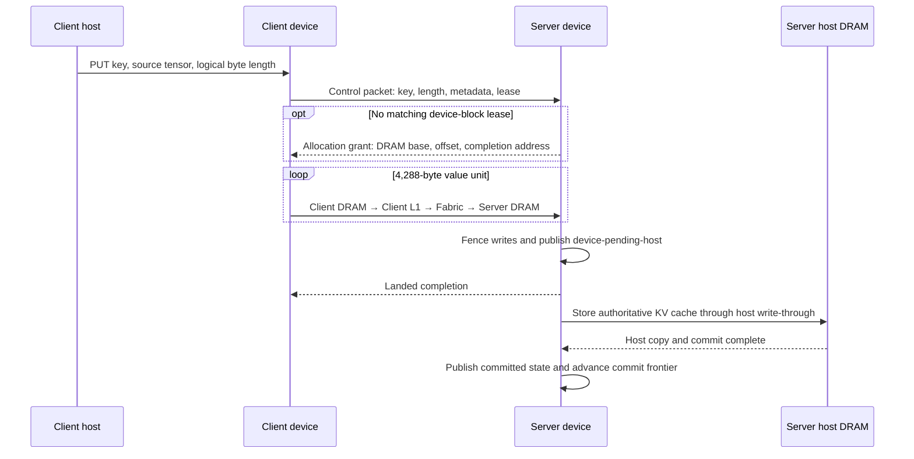
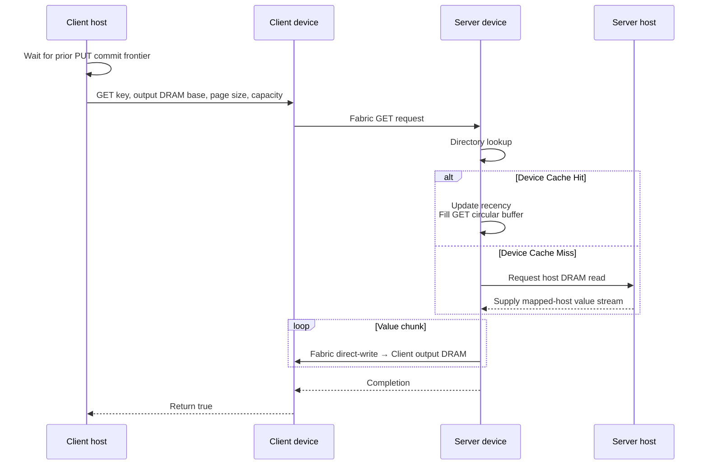

# Architecture

TT-Infinity sends KV-cache operations produced by vLLM and LMCache to a separate TT-Fabric cache service through its `kvcache-manager` runtime. This document describes repository ownership, vLLM integration, and the manager data path.

## Components and Responsibilities

| Area | Role | Owner |
| --- | --- | --- |
| Model serving | Request scheduling, model execution, and paged KV-cache management | vLLM |
| Cache integration | Prefix lookup, chunking, and paged KV-block save/restore | LMCacheConnector and the vLLM TT plugin |
| Cache service | Public C++/Python `Client` and `Server` APIs, sessions, cache semantics, server lifecycle, host backing, and tiering | `kvcache-manager` |
| Device data path | Fabric configuration and routing, operation programs, wire protocol, device kernels, and gather/scatter | TTNN and tt-metal |
| Deployment | Physical-link management, process coordination, and shutdown ordering | Deployment environment |

The validated serving stack uses stock vLLM 0.24.0. The repository-pinned and patched Tenstorrent vLLM TT Plugin connects vLLM scheduling and model execution to the TT runtime and provides the model-side hooks used by `T3knicKVConnector` for external KV-cache save and restore.

Applications import `Client` and `Server` from the `kvcache_manager` package. `ttnn.kvcache_manager` provides device operations and constants used by the manager, but not product-level `Client` or `Server` objects.

The manager builds against an installed `TTNN::TTNN` package; it does not compile tt-metal sources directly or include private headers. The patch series under `third_party/tt-metal` adds the TTNN operations, protocols, and kernels shared by the manager, vLLM TT plugin, and LMCacheConnector to one tt-metal tree. See [Development, Build, and Test](development.md).

## vLLM Integration

Before prefill, the vLLM scheduler uses LMCache's `exists` path to find the longest reusable contiguous prefix. A worker retrieves hit blocks through `Client.get()`, restores them into the paged KV cache, and prefills only the remaining tokens. When prefill creates new blocks, the connector stores them through `Client.put()`.

`kvcache-manager` does not interpret prompts, tokens, or vLLM requests. It provides PUT, GET, EXISTS, and DELETE semantics for connector-generated keys and values. Intranode deployments and Galaxy-to-T3K internode deployments use the same public API and Fabric wire protocol. See [Using TT-Infinity with vLLM and LMCache](usage.md) for the integration contract.

## Internal Implementation

### Public Operations

| Operation | Behavior |
| --- | --- |
| PUT | Receives the value in server device DRAM, then writes through to the authoritative host-DRAM copy. |
| GET | Returns a device-DRAM copy directly over Fabric; on a miss, reads the authoritative host copy and optionally promotes it back to the device cache. |
| EXISTS | Reports whether a key exists. |
| DELETE | Removes a key and reports success. |

### Client and Session

The host-side `Client` owns connection, session, and close lifecycles. ESTABLISH requests and responses exchange the required wire state over Fabric. The client then runs PUT and GET programs through an opaque `ClientOperations` handle supplied by the matching TTNN library.

Python bindings use TTNN's registered `Tensor`, `MeshDevice`, and `MeshCoordinate` types directly. Tensor data travels from client device operations over Fabric rather than through a host-network API.

### Server and Storage Tiers

`Server` consists of persistent device and host runtimes. The device runtime handles request dispatch, the key directory, and the device-DRAM cache. The host runtime manages authoritative host-DRAM copies and movement between tiers. Sources under `src/native/ttnn/server_runtime` compile into `libkvcache_manager`; TTNN supplies protocol headers and device kernels.

When the device cache is full, eviction removes only the LRU device copy and retains the host copy. Device DRAM is the hot tier; host DRAM is the larger authoritative tier. This separation keeps hits on-device while allowing values beyond device capacity to be fetched from the host tier.

Static multi-shard servers share one endpoint-scoped 1 GiB pinned host arena. The arena is divided into page-aligned per-shard slices (128 MiB with eight shards), keeping the aggregate Wormhole NoC mapping within the available pin budget. Each slice contains that shard's staging and control regions plus any remaining mapped host-value pool. If a 1 GiB hugepage is unavailable or a configured staging region does not fit its default slice, the server uses one compact shared-memory staging arena and still attempts a NoC mapping. If that mapping is unavailable, targeted PCIe copies preserve correctness without a mapped host-value pool.

### PUT Flow

### GET Flow

